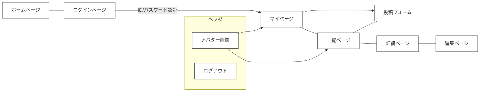
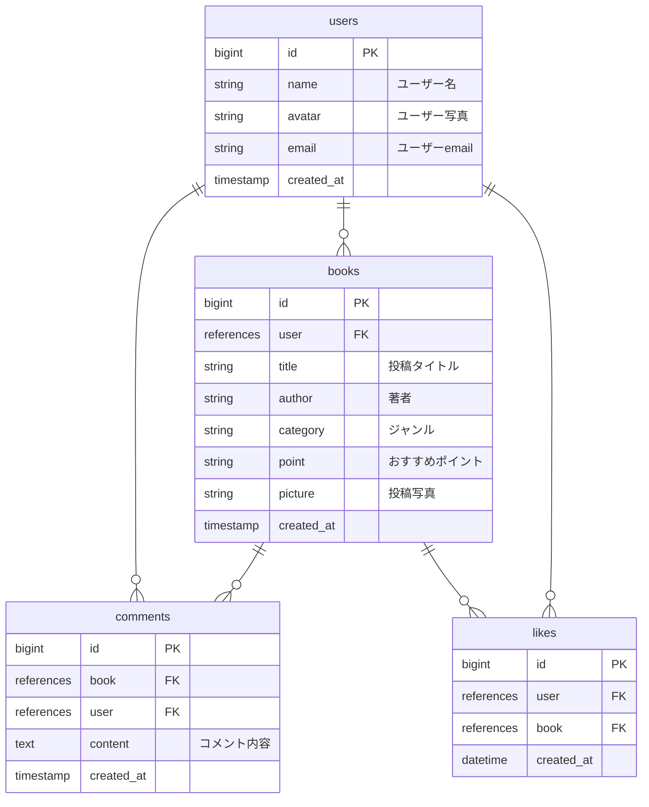

## BOOK-TOWN

「BOOK-TOWN」は、本を読んでみたいけれど何を読んだらいいか分からないという方や、これまで読んだことのないジャンルのおすすめを知りたいという方々の悩みを解決するアプリ

### URL

ブラウザで https://book-town-alpha.vercel.app/ を開くと表示されます。

### テスト用アカウント

ID test@gmail.com

Pass 123456

## 機能

・認証機能（新規登録、サインイン、ログアウト）

・投稿機能（投稿、編集、削除）

・コメント機能（投稿、削除）

・フィルタリング機能

・並び替え機能

・いいね機能

・ユーザー編集機能（名前）

## 使用技術

### フロントエンド

・TypeScript(v5.1.6)

・React(v18.2.0)

・Next.js(v13.4.8)

・MUI(v5.13.7)

### バックエンド

・firebase(v10.0.0)

## 画面遷移図

## ER図

## 今後の実装予定機能

・アバター画像の変更

・いいねしたリストを表示

・google 認証

・コメント時に画像投稿ができる機能

・バックエンドのnode.jsを学習しfirebaseから切り替える
